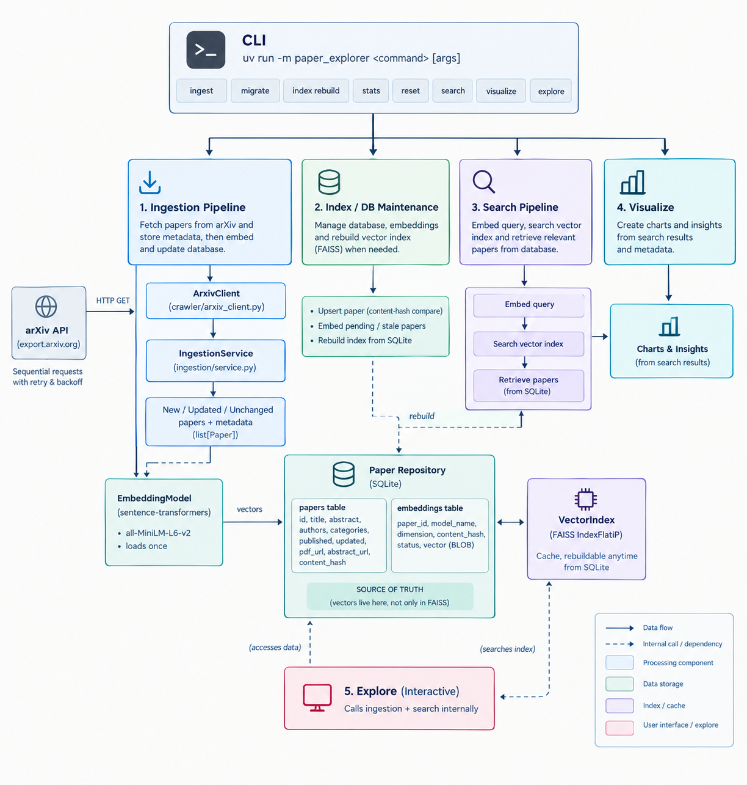

# Intelligent Paper Explorer

**Intelligent Paper Explorer** is a command-line toolkit for discovering, searching, and navigating academic papers from [arXiv](https://arxiv.org). It builds a local, persistent, incrementally-updated library of papers, and searches that library using semantic embeddings, classic keyword search (BM25), a tunable hybrid of both, and optional cross-encoder reranking for higher precision.

## Motivation

Researchers and students face thousands of new papers a month. Keyword search on arXiv/Google Scholar often misses conceptually related work phrased with different terminology, while pure semantic search can under-rank exact terms, acronyms, or author names. The Intelligent Paper Explorer builds a personal, local, searchable library over any topic you choose, and lets you search it by meaning, by exact keyword, or both, with results you can re-run instantly and offline, without re-querying arXiv every time.

## What it does

- **Ingests** papers from the live arXiv API into a local SQLite database, computing an embedding for each paper once and only once.
- **Persists, tracks, and resumes** ingestion: re-running the same query skips unchanged papers, re-embeds only papers whose text have actually changed, and survives being interrupted mid-run.
- **Searches** the local library three ways: semantic (embeddings + FAISS), keyword (BM25), or a normalized hybrid of both. All three are entirely offline once papers are ingested.
- **Reranks** search candidates with a local cross-encoder for higher precision, without ever scanning the full corpus.
- **Filters** search results by arXiv category and publication date.
- **Interactively explores**: type a query, and it auto-ingests from arXiv only if your local library doesn't already cover the topic well, then searches with hybrid+rerank and shows meaningfully-scaled (0-1) scores.

## Installation

Requires Python >= 3.10 and [uv](https://docs.astral.sh/uv/).

```bash
git clone https://github.com/Sk47R/Intelligent-Paper-Explorer.git
cd paper-explorer
uv pip install -e .
```

Verify the install:

```bash
uv run -m paper_explorer --help
```

> Note: The first time you run any command that embeds text, `sentence-transformers` downloads a small pretrained model (~90MB) from Hugging Face and caches it locally; the first time you use `--rerank` or `explore`, it additionally downloads a small cross-encoder model (~80MB). Both are one-time downloads. After that, everything runs fully offline.

## Quickstart

```bash
uv run -m paper_explorer ingest --query "transformer attention NLP" --max-results 100
uv run -m paper_explorer index rebuild
uv run -m paper_explorer stats
uv run -m paper_explorer search "attention is all you need" --mode hybrid --rerank --top-k 10
```

Or, for a fully interactive experience that auto-ingests when needed:

```bash
uv run -m paper_explorer explore
```

## Architecture



## Commands

All commands accept global `--db`, `--index`, and `--id-map` flags to point at a different database/index location than the defaults (`data/processed/papers.db`, `data/index/papers.faiss`, `data/index/id_map.json`). Add `-v` to any command for debug logging.

### `ingest` -- fetch papers from arXiv into the local library

```bash
uv run -m paper_explorer ingest --query "transformer attention NLP" --max-results 200
uv run -m paper_explorer ingest --query "graph neural networks" --max-results 200 --category cs.LG
uv run -m paper_explorer ingest --query "reinforcement learning" --max-results 100 --start 100
uv run -m paper_explorer ingest --query "diffusion models" --max-results 100 --no-raw
```

Re-running the same query is safe and cheap: unchanged papers are skipped entirely; only new or textually-changed papers are (re-)embedded.

### `migrate` -- import an existing `papers.json` into SQLite

```bash
uv run -m paper_explorer migrate --from-json data/processed/papers.json
```

Only needed if you have data from an older JSON-based version of this project you want to carry forward. Safe to skip entirely on a fresh setup.

### `stats` -- inspect the local library

```bash
uv run -m paper_explorer stats
```

Shows total papers, embedded/pending/stale/failed counts, the embedding model and dimension in use, detected categories, the publication date range, and how many vectors are currently indexed.

### `index rebuild` -- reconstruct the FAISS index without re-embedding

```bash
uv run -m paper_explorer index rebuild
```

Rebuilds `papers.faiss`/`id_map.json` purely from vectors already stored in SQLite. Useful if the index file is deleted or corrupted. It does not involved data loss, arXiv calls, or model inference.

### `reset` -- wipe everything and start over

```bash
uv run -m paper_explorer reset --yes
```

Deletes all papers, embeddings, and the FAISS index. Irreversible.

### `search` -- search the local library

```bash
# Semantic (default) -- meaning-based
uv run -m paper_explorer search "attention is all you need" --top-k 10
uv run -m paper_explorer search "attention is all you need" --mode semantic --top-k 10

# Keyword (BM25) -- exact-term based
uv run -m paper_explorer search "LoRA fine-tuning" --mode keyword --top-k 10

# Hybrid -- combines both, tunable balance
uv run -m paper_explorer search "transformer architectures for NLP" \
    --mode hybrid --alpha 0.7 --candidate-k 50 --top-k 10

# Hybrid + cross-encoder reranking
uv run -m paper_explorer search "transformer architectures for NLP" \
    --mode hybrid --candidate-k 50 --top-k 10 --rerank

# Metadata filters (combine with any mode)
uv run -m paper_explorer search "transformer NLP" --category cs.CL --top-k 10
uv run -m paper_explorer search "transformer NLP" --from-date 2022-01-01 --to-date 2023-12-31
```

`search` never contacts arXiv. It only searches papers already in the local database, and only ever embeds the query text at search time (never the corpus, which is embedded once during `ingest`).

### `visualize` — generate comparison plots for a query

```bash
uv run -m paper_explorer visualize "attention is all you need" --top-k 10
```

Runs the given query through semantic, keyword, and hybrid search,
plus hybrid+reranking, and saves two PNGs to `data/plots/`:

- `mode_overlap.png` — how much the three search modes' top-K results overlap
- `reranking_impact.png` — retrieval score vs. rerank score per candidate

This is a separate command from `search`: `search` never produces plots, and `visualize` never prints a results table.

### `explore` -- interactive search with automatic ingestion

```bash
uv run -m paper_explorer explore
```

Prompts for a query in a loop. For each query:

1. Runs a quick local semantic check. If the best local match scores below `--threshold` (default `0.35`) or the library is empty, then it treats the topic as not yet covered.
2. If not covered, automatically ingests exactly 100 papers from arXiv on that query, then rebuilds the index.
3. Searches with **hybrid + reranking** (the most accurate combination available), and displays scores on a consistent, meaningful **0.0 to 1.0 scale, where 1.0 is the strongest match**.
4. Loops back for another query. Type `quit` to exit.

```bash
uv run -m paper_explorer explore --threshold 0.4 --top-k 10 --candidate-k 50
```

## Search techniques explained

- **Semantic search**: The query is converted into an embedding and compared with pre-computed paper embeddings using FAISS (`IndexFlatIP`). Since the vectors are normalized, the inner product corresponds to cosine similarity.

- **Keyword search (BM25)**: Uses classic lexical search over each paper's title and abstract with the `rank-bm25` library. It runs entirely offline and does not require any additional downloads.

- **Hybrid search**: Retrieves up to `candidate_k` candidates from both semantic and keyword search independently. Each result list is then min-max normalized to the range [0, 1]. This is necessary because BM25 scores are unbounded and cannot be directly compared with cosine similarity scores. The normalized scores are combined using:

  `hybrid_score = alpha * semantic_norm + (1 - alpha) * keyword_norm`

- **Cross-encoder reranking**: A cross-encoder processes the query and candidate paper together, allowing the model to capture interactions between query and document tokens. This generally gives more precise relevance estimates, but running it across the entire corpus would be too expensive. The system therefore uses a retrieve-then-rerank approach. The first-stage search retrieves a smaller pool of `candidate_k` papers, and the cross-encoder (`cross-encoder/ms-marco-MiniLM-L-6-v2`) reranks only those candidates. The model runs locally, is free to use, and does not require a paid API. Since only the candidate pool is reranked, the cost of reranking remains manageable even as the overall paper library grows.

## Visualizations

Two visualizations are available via the `visualize` command (or directly as library functions), saved as PNG files, never displayed inline:

- **`plot_reranking_impact(results, output_path)`** — scatter plot of first-stage retrieval score vs. cross-encoder rerank score for the same candidates, colored by how much each candidate's rank changed. Shows concretely whether reranking substantially reorders results or mostly agrees with first-stage retrieval, for a specific query.
- **`plot_mode_overlap(semantic_results, keyword_results, hybrid_results, output_path)`** — bar chart of how many top-K papers are unique to each search mode versus shared across modes, demonstrating that hybrid search isn't simply duplicating semantic or keyword results.

Both are demonstrated in `notebooks/example_usage.ipynb` and saved to `data/plots/`.

## Testing

```bash
uv pip install -e ".[dev]"
pytest tests/ -v
ruff check .
ruff format --check .
```

The test covers the main parts of the project, including the `Paper` model, JSON storage, the SQLite schema and repository, and operations such as insert, update, duplicate detection, content hashing, embedding status, metadata filtering, and transactions.

It also covers incremental and resumable ingestion using mocked arXiv clients and embedding models, so the tests do not require network access or model downloads. Other areas covered include database migration, BM25 tokenization and ranking, hybrid search score normalization and candidate merging, including cases such as `alpha=0`, `alpha=1`, empty results, and `top_k` larger than the corpus.

The reranker, search pipeline, visualization functions, and CLI argument parsing are also tested. All external dependencies are mocked where necessary, so the test suite never makes a real arXiv API request or downloads a real machine learning model.

## Limitations

- **arXiv API rate limiting**: `export.arxiv.org` enforces aggressive rate limits (HTTP 429) that can persist for hours regardless of client-side pacing, retries, or backoff. This is a known, widely reported issue in the broader developer community, not specific to this tool. `ArxivClient` retries with exponential backoff and fails cleanly with a clear error rather than hanging or crashing, but cannot bypass an upstream rate limit. If `ingest` fails repeatedly with 429 errors, wait and retry with a smaller `--max-results`.

- **No continuous background ingestion:** the current system ingests papers when explicitly requested through ingest or automatically through explore when the local library does not sufficiently cover a query. A future version could introduce scheduled or event-driven ingestion when reliable upstream access is available.

- **Search only covers title + abstract:** the current system searches metadata and abstracts rather than the full text of paper PDFs.

## Development history

This project was built iteratively across several phases, each adding a coherent capability on top of the last:

1. A working semantic search engine over arXiv (crawling, embedding,
   FAISS search).
2. Hybrid retrieval (local BM25 keyword search, normalized score
   combination, tunable `alpha`).
3. Cross-encoder reranking (a second, more precise retrieval stage
   that never scans the full corpus).
4. Persistent, incremental, resumable ingestion (replacing JSON
   storage with SQLite, content-hash-based change detection).
5. An interactive auto-ingesting search command (`explore`) and
   standalone comparison visualizations (`visualize`).
